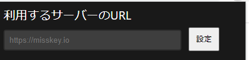

### misskey-share-extension-for-youtube

misskeyにyoutubeの動画をシェアしたいときに他のボタンをクリックして開いたやつからコピーしてmisskeyに張り付けるのが面倒なのでmisskeyのシェアボタンを追加できる拡張を作りました。

youtubeの視聴ページなどで共有をクリックして出てくるダイアログにmisskeyへの共有ボタンを表示します。

アイコンは [misskey_dev/assets](https://github.com/misskey-dev/assets )のものを取ってきています githubが調子悪いときはアイコンが表示されなくなることがあります。

youtubeの仕様変更などにより表示崩れや挙動がおかしくなることがあると思うのでその時は[misskeyアカウント(@king_of_emotion)](https://misskey.io/@king_of_emotion) に連絡してください。

拡張機能をクリックするとシェア対象のサーバーを設定することができます
`https://misskey.io` のように入力してもらえると正しく動きます
misskeyはサーバーが多く存在し個人サーバーなどもあることから特に存在しているかのチェックは行っていません
正しく動かない場合は入力したURLに/shareを付け足してブラウザで開いてみて開けるかどうかを確認してもらえると助かります
**デフォルトでは`misskey.io`にシェアするようになっています**

シェアはmisskeyの/shareで共有を行うようにしています
[/shareの公式ドキュメント](https://misskey-hub.net/docs/features/share-form.html)

